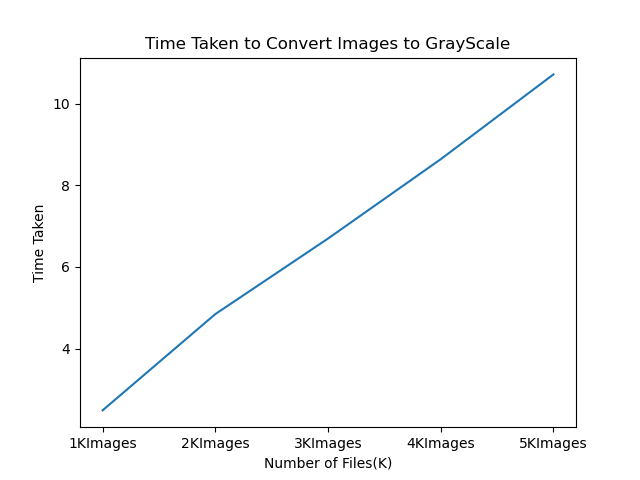

# Convert Colored Images to Gray Scale Images and Analysis

This project tries to analyze the time taken to convert different number of images to grayscale particularly, 100,200....

## Install Dependencies using pip
```
pip install opencv-python
```

## Results 

| Number of Images |Time taken to convert to Gray Scale| 
| ------------- | --------- |
| 100  | 1.995 s  | 
| 200  | 3.997 s |   
| 300  | 5.869 s   |  
| 400  | 8.362 s   |
| 500  | 9.881 s   |

## Graph




## Conclusion
The nature of the graph should be linear in ideal case for converting lower scale images to upper scale. However, if different images  or different hardware is used, the results may vary.