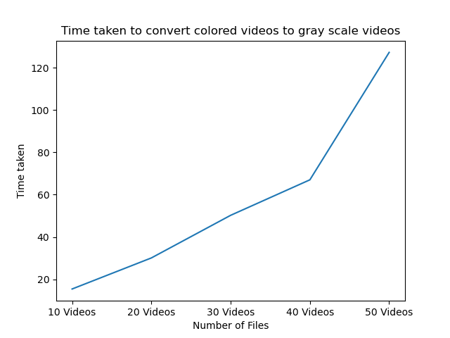

# Convert Videos to Gray Scale and analyze the time taken for this conversion 

This minor project tries to analyze the time taken to convert videos to grayscale and note the time taken to do so .


## Install dependencies using pip
```
pip install matplotlib
pip install opencv-python
```

## Results 

| Number of Video Files |Time Taken to convert to grayscale | 
| ------------- | --------- | 
| 10  | 15.415s  |   
| 20  | 30.09s |   
| 30  | 50.22s   |   
| 40  | 67.0032s   |   
| 50  | 127.219s   |  


## Graph 



## Command Line Solution 
```
py <scriptname.py> videofile
```

## Conclusion 
Converting a video to gray scale is time consuming task. The performance mmay vary 