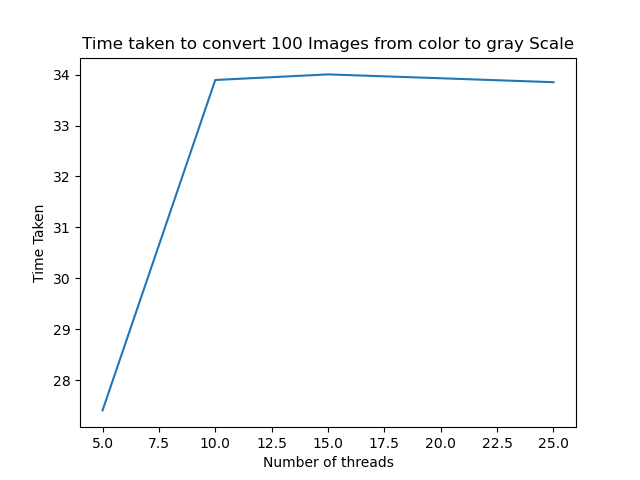

# Multithreading Solution to convert colored Vidoes to gray scale and analysis

This project converts colored images to gray scale Videos and notes the time taken for the same.


## Install dependencies using pip
```
pip install matplotlib
pip install python-opencv
```


## Results
The results were taken for 100 files

| Number of Threads | Time Taken | 
| ------------- | --------- |
| 5  | 12.153368711471558 s  | 
| 10  | 10.797546148300171 s |   
| 15  | 11.191178321838379 s   |  
| 20  | 11.385918140411377 s   |


<br>

## Graphical  Representation for number of files vs time taken 
<br>

  

<br>
Conclusion : The time taken for converting files to gray scale first increases , then decreases by increasing threads. This is because at the beginning, parellism is achieved but later, the context switches time increasing due to frequent switching and time increases.
<br>

## Command Line Solution
To use the command line solution 
```
python <script>.py inputdir no_of_threads
```
