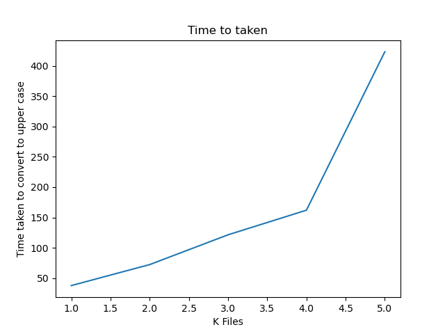

# Convert Lower Case Text Files to Upper Case and analyze results for different file sizes

This project tries to convert characters of lowerr case text files to upper case and analyze the time taken to do so for various different files of size ~10 Mb


## Install dependencies using pip
```
pip install matplotlib
```


## Results


| Number of Files |Time taken to convert to upper case | 
| ------------- | --------- |
| 100  | 37.6720 s  | 
| 200  | 72.289 s |   
| 300  | 121.39 s   |  
| 400  | 161.998 s   |
| 500  | 423.251 s   |

<br>

## Graphical  Representation for number of files vs time taken 
<br>

  

<br>
Conclusion : The nature of graph should be linear for ideal case. Its not linear for real life scenarios because of different processes running in the background or due to hardware failure.
<br>

## Command Line Solution
To use the command line solution 
```
python <script>.py inputdir outputdir
```
