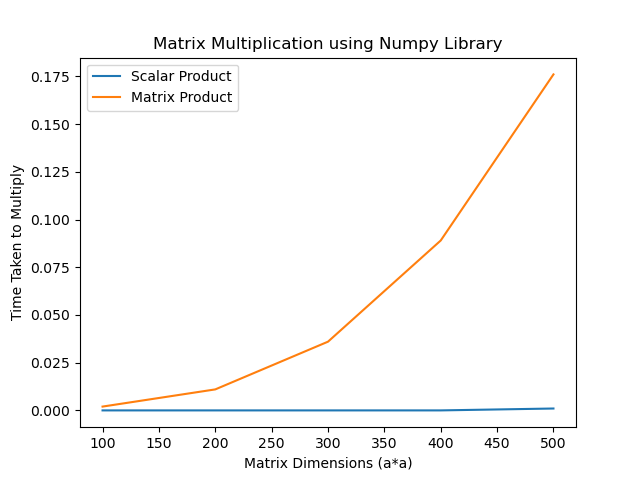
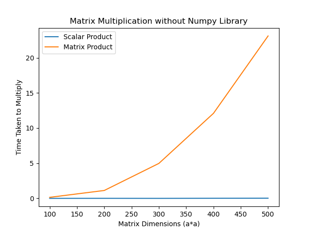

# Matrix Multiplication Analysis using Numpy and Naive

This minor project tries to analyze the efficiency of Numpy Library by using its inbuilt functions with naive methods (Naive functions are prepared by me).


<br>

## Install dependencies using pip
```
pip install matplotlib
pip install numpy
```

## Results


| Dimensions |Time Taken Using Numpy | Time Without Numpy
| ------------- | --------- | ---------|
| 100x100  | 0.0020017623901367188s  |   0.21523165702819824s   |
| 200x200  | 0.00200123473024732432s |   1.233914852142334s   |
| 300x300  | 0.012970209121704102s   |   5.258261680603027s   |
| 400x400  | 0.029423952102661133s   |   13.2677227234840393s   |
| 500x500  | 0.031249046325683594s   |  26.77227234840393s    |

<br>

## Graphical Comparision for Scalar and Matrix Multiplication Methods using Naive and Numpy
<br>

|                 Using Numpy Library              |                 Without Using Numpy Library                 |
|:-------------------------------------------------:|:-------------------------------------------------:|
|  |  


Conclusion : Numpy Library is much faster than the Naive methods

<br>

## Command Line Solution
To use the command line solution 
```
python <script>.py inputfile outputfile <1/2>
```

1 means Scalar Product <br>
2 means Matrix Product

<br>

### Input Format (Don't give blank lines as input in input file)
```
2 2  <Dimensions>
1 2  <1st
3 4   Matrix>
2 2  <Dimensions>
1 2    <2nd
3 4     Matrix>
```
Output will be desired matrix
