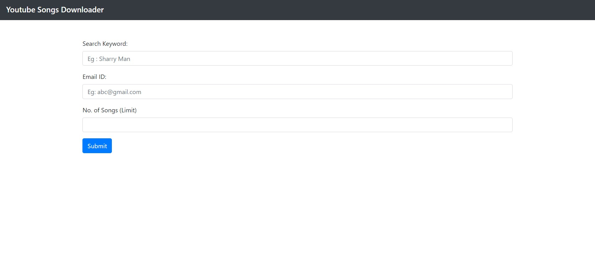

# Youtube Song 🎵 Downloader 📹 🔽

A simple web application to download youtube songs and send them to desired email id

## Dependencies

```
pip install pytube
pip install flask
pip install pydub
```


## Usage 

1. Set the credentials in the credentials.py file from which the songs will be sent to the desired email id.
2. Make sure to allow desired google permissions for the application to work.
3. Run : python app.py

### Note : Current Version of this application is unstable.

## Screenshots 




## Made by Developers </>
## Made with Love ❤️
